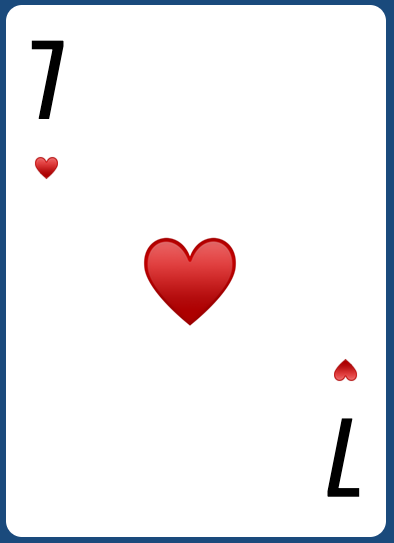

#### _English version_

<h1 align="center">Card game «Memory»</h1>
<h2 align="center">

<p align="center">


</p>

## Description

<p align="center"></p>

The game was implemented from scratch on TypeScript. It contains 3 difficulty levels, several timers and random card sets.

## How to play

- Choose the level of difficulty

  - _**1** - the easiest, contains 6 cards,_
  - _**2** - medium, contains 12 cards,_
  - _**3** - the most difficult, contains 18 cards._

- Try to memorize all pairs of cards in 5 seconds until the cards are turned over
- Try to open all the same pairs of cards as quickly as possible

## About the project

- Each set of cards is random
- Flip implemented using animation
- Each and every card is 100% css (scss) except the PNG shirt

  <p align="center"></p>

## Available Scripts

```
npm install
npm run start
```

Runs the app in the development mode.\
Open [http://localhost:8080](http://localhost:8080) to view it in the browser.

The page will reload if you make edits.\
You will also see any lint errors in the console.
<br>
<br>

#### _Русская версия_

<h1 align="center">Карточная игра «Найди пару»</h1>
<h2 align="center">

<p align="center">


</p>

## Описание

<p align="center"></p>

Игра была реализована с нуля на TypeScript. Она содержит 3 уровня сложности, несколько таймеров и случайные наборы карт.

## Как играть

- Выберите уровень сложности

  - _**1** - самый легкий, содержит 6 карт,_
  - _**2** - средний, содержит 12 карт,_
  - _**3** - самый сложный, содержит 18 карт._

- Попытайтесь запомнить все пары карточек за 5 секунд, пока карты не перевернулись
- Постарайтесь как можно быстрее открыть все одинаковые пары карт.

## О проекте

- Каждый набор карт случайный
- Переворот реализован с использованием анимации
- Каждая карта на 100% состоит из css (scss), кроме рубашки PNG.

  <p align="center"></p>

## Как запустить

```
npm install
npm run start
```

Запускает приложение в режиме разработки.\
Откройте [http://localhost:8080](http://localhost:8080), чтобы просмотреть его в браузере.

Страница перезагрузится, если вы внесете изменения.\
Вы также увидите любые ошибки lint в консоли.
<br>
<br>
